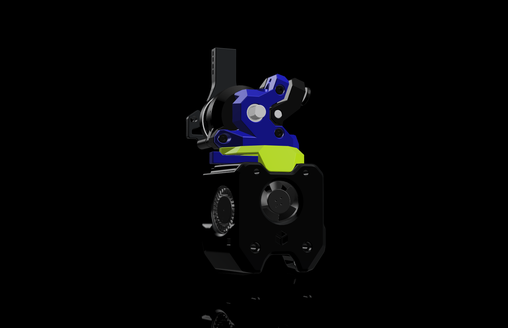
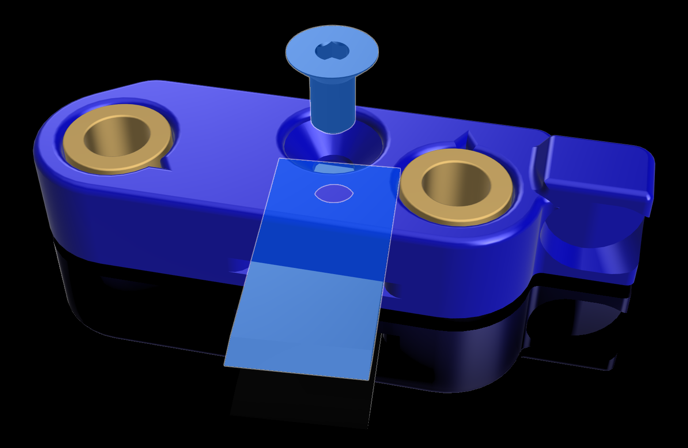

[![CC BY-NC-SA 4.0][cc-by-nc-sa-shield]][cc-by-nc-sa]

# A4T-AFC: [A]nother [4]010 [T]oolhead - [A]nother [F]ilament [C]utter

## BETA Release

A toolhead cutter mod from:  [SouthAsh1](https://ko-fi.com/southash1)

  
A filament cutter mod designed around the A4T that is designed by DW-Tas. Focused on keeping the original size as close as possible while still keeping the build relatively simple.   

I will try to get the board mounts made soon.

> [!NOTE] 
> ### Total WIP 
> This mod is still a WIP and some things may change, most changes will be minor. Also the CAD will come out later. 

  

> [!WARNING]
> ### Very Sharp  
> This project requires you to modify very sharp objects. I will cover how to handle these when I get to finishing the instalation instructions very soon. 

 

## Bill of Materials (BOM)
***`*Not including stock A4T hardware`***
| Qty | Item                                          | Notes                        |
| --- | --------------------------------------------- | ----------------------------------------------------------------------------------------- |
| 1   | Bambu Blade                                   | This mod uses a Bambu Labs filament cutter blade that has been stripped of its plastic. <a href="https://us.store.bambulab.com/products/replacement-filament-cutter?_pos=1&_ss=r">Bambu Blade</a>|
| 1   | 0.5x4x15 Spring                               | Any spring that is 4mm in diameter and no longer than 15mm should work your milage may vary for cutting force needed.|
| 1   | M2 x 4 FHCS                                   | Keeps the blade from sliding in and out.|
| 2   | M2 `Flange` Heatsets                          | This is the bread and butter of tolerances for the build.   Recommended: ---<a href="https://www.digikey.com/en/products/detail/tri-star-industries-inc/HM20X157C/14205393">Digikey</a>   Alternative: --------<a href="https://www.aliexpress.us/item/3256805733805809.html">Ali Express</a>|
| 2   | 3 x 10 mm pin                                 | Pivot pins for the `Link`  Example: <a href="https://www.amazon.com/uxcell-Stainless-Cylindrical-Support-Elements/dp/B07Y58VWDW?th=1">Amazon</a>|
| 2   | 3 x 12 mm pin                                 | Pivot pins for the `Cutter Arm` and `Blade Holder`  Example: <a href="https://www.amazon.com/uxcell-Stainless-Cylindrical-Support-Elements/dp/B07Y58CFYF?th=1">Amazon</a>|
| 4   | 3 ID x 5 OD x 5 H mm Sleeve Bearings                  | Bearing surfaces for the pins to guide on.   Example: <a href="https://www.amazon.com/uxcell-Bearings-Wrapped-Bushings-Machinery/dp/B0CW31938R?th=1">Amazon</a>|
| 1   | M3 Threaded Heat Insert                       | Standard Voron spec: M3 x 5 x 4|
| 1   | M3 x 6 SHCS                                   | Holds the `Extruder Adapter` on.|
|     | **OPTIONAL**                                  |
| 4   | M2.5 x 8 / M2.5 x 12 FHCS                     | To mount the hotend for ONLY the UHF options. 12mm length if you are using the spacer.|
|     | **Extruder Mounting Screws**                  |
|     | WWBMG, Orbiter                                | 2-`M3x18 SHCS`|
|     | WWG2                                          | 1-`M3x20 SHCS` 1-`M3x18 SHCS`|
|     | Sherpa                                        | 2-`M3x24 BHCS` Sorry but you need to file/sand down 1mm on 25mm screws.|

## Printing parts
### Print settings
> [!WARNING] 
> Recommended to print the `Link` and `Blade Holder` with 100% infill. 

Parts are meant to be printed in 0.2mm layer heights, 0.25mm first layer should be OK. Other layer heights will cause the built-in supports to fail or fuse to the printed part. 
Print settings will depend on your printer setup / filament used / phase of the moon/etc. 
The parts are not pre-scaled for any particular filament type. You will need to tune the filament you use for correct shrinkage compensation to get good results. Development was done with multiple brands of ASA and ASA-CF filaments (each individually tuned). 

General voron-like settings are a good starting point for 0.4mm wall widths (four walls, 5 top/bottom layers and 40% infill). 

⚠ If you have any under-extrusion you will have problems with the parts stretching and not keeping rigidity. ⚠

(Similar rules of A4T applies here so I kind of copied and pasted, sue me...)

## Assembly
### Assembly Steps

These istructions should be followed in conjunction with original <a href="https://github.com/Armchair-Heavy-Industries/A4T">A4T instructions</a>.

:information_source: CW2 and Tap users have to build the toolhead on the printer, Xol Carriage users can build off the printer.
| 
Notes
                                                                                                | Images|
| ---------------------------------------------------------------------------------------------------------------------------------------------------------------------------------- | :-----: |
| Prep the M2 inserts for install by drilling them out with a 5/64 or 2mm Drill Bit, then in one of them chamfer the top and the other chamfer the bottom. |   |
| **Preping the Blade Holder** |
| Start by using a pair of vise grips, a pair of pliars, or a vise that can firmly grasp the blade and prevent it from moving. |   |
| Next, using flush cutters, cut the tab on the back `⚠⚠ flying parts ⚠⚠` and start triming the plastic off one side. |   |
| When you get enough plastic off one side then the other side can just be pulled off then you will get a clean blade ready for install. |   |
| There are alternate types of Bambu blades that may differ depending on where on the globe you buy them on, they will still work. |   |
| Insert 2 of the `Sleeve Bearings` into the `Blade Holder` |   |
| With the blade still in the vise grips, slide it into the Blade Holder. Install the M2 FHCS making sure you don't overtighten as it's going into plastic. |   |
| Insert the 2 remaining `Sleeve Bearings` into the `Cutter Bar` |   |
| Insert the 2 `3x10mm Pins` into the `Link` the pins will stick out the top with 5mm coming out the bottom. Picture is showing the bottom of the link. |   |
| **Preping the Extruder Adapter** |
| Install the M2 insert that is chamfered on the bottom into the Extruder Adapter. |   |
| **Cutter Install** |
| Before installing, CW2 and Tap users need to install the cowl to the carriage now. |
| UHF users will need to use `M2.5x8/12 FHCS` to install the hotend. |
| Insert the M3 insert |   |
| Insert the M2 insert that is chamfered on the top into the cowl making it flush with the surface. |   |
| Insert the 2 `3x12mm Pins` into the cowl. |   |
| Carefully install the `Blade Holder` |   |
| Install the `Cutter Arm` |   |
| Install the `Link` |   |
| Using some tweasers install the spring, being sure to secure the ends into the holes. Test out the mechanism to make sure it resets with no binding. |   |
| Last the Extruder adapter can be installed and secured with an `M3x6 SHCS`. The rest of A4T instructions can be continued. |   |

 

### 

### Credits
* Thanks to everyone that supported my last project/mod.
* Thanks to DW-Tas for all the help provided and for designing <a href="https://github.com/Armchair-Heavy-Industries/A4T">A4T</a>.

Go support the guys over at <a href="https://github.com/Armchair-Heavy-Industries">Armchair Heavy Industries</a> as they are making some awesome stuff over there!

## Enjoy using A4T-AFC
This work is licensed under a
[Creative Commons Attribution-NonCommercial-ShareAlike 4.0 International License][cc-by-nc-sa].

[![CC BY-NC-SA 4.0][cc-by-nc-sa-image]][cc-by-nc-sa]

[cc-by-nc-sa]: http://creativecommons.org/licenses/by-nc-sa/4.0/
[cc-by-nc-sa-image]: https://licensebuttons.net/l/by-nc-sa/4.0/88x31.png
[cc-by-nc-sa-shield]: https://img.shields.io/badge/License-CC%20BY--NC--SA%204.0-lightgrey.svg

### License clarification regarding non-commercial use:
The non-commercial aspect of this license is for cases where A4T is the product, not the use of A4T to create products. 
I.e. If you wish to sell A4T as a product, you would need to seek a commercial license before doing so.  
It is NOT intended to prevent the use of A4T in a printer that you use to provide commercial services. If you want to run A4T as a toolhead for your print farm printers, go right ahead.
